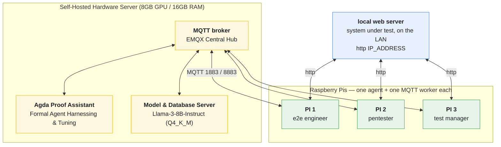

# open-testing-agents-paiselfhost

**three Raspberry Pis with Nix**, coordinated over
**MQTT**. The target is a local web server reachable from all three Pis.

Every tool is pulled from the **nixpkgs** package set via the **Nix package
manager** — you do **not** need to be on NixOS. Host systems (the MQTT
broker, the SUT, optional GPU / model / database servers) are provisioned
with **Terraform/OpenTofu**.



Each Raspberry Pi runs **one agent** and one MQTT worker. The workers chain
results: e2e → pentester → test manager → final report, all over MQTT topics.
The **64-bit hardware server** (broker, Agda validator, and local LLM host) joins the same network
over MQTT, so the crew can offload formal proof verification, model inference, and databases onto machines
with dedicated resources.

## Architecture

| Topic                    | Published by   | Consumed by       | Payload                        |
|--------------------------|----------------|-------------------|--------------------------------|
| `crew/start`             | trigger (we)   | PI 1 (e2e)        | anything (kickoff)             |
| `crew/pentester/input`   | PI 1 (e2e)     | PI 2 (pentester)  | playwright output              |
| `crew/manager/input`     | PI 2 (sec-test)| PI 3 (manager)    | security findings              |
| `crew/proof/verify`      | Any Agent      | Agda Service      | Agda source code / properties  |
| `crew/proof/feedback`    | Agda Service   | Origin Agent      | Type-checking logs / AST errors|
| `crew/final`             | PI 3 (manager) | monitor/dashboard | final markdown report          |
| `crew/status/<role>`     | each worker    | monitor           | JSON lifecycle state           |

- The previous phase's output is saved to `previous_output.md` in the
  worker's working directory (`build/<role>/`) and read via the agent's
  `FileReadTool`; the final `report.md` lives there too.
- Broker host, `TARGET_URL`, TLS settings and broker **credentials** live in
  `build/<role>/.env` (never committed); the roles' MQTT passwords are set on
  the broker.

## Formal Verification with Agda

To enforce rigorous behavior and prevent hallucination cycles during agent collaboration, **Agda** is introduced as a interactive proof assistant. 
- **Harnessing:** Agent action boundaries, tool pre-conditions, and state transitions are modeled as formal types in Agda.
- **Tuning:** Agents can emit structural changes or code parameters along with an Agda specification file to `crew/proof/verify`. The tuning parameters are only accepted if the Agda compiler successfully type-checks the safety proofs, providing a mathematically guaranteed sandbox loop.

## Hardware & Local Model Specs

The infrastructure utilizes a single self-hosted server with the following constraints:
* **System RAM:** 16 GB
* **GPU VRAM:** 8 GB

### Fitted Model Selection
To stay within the **8GB VRAM** safety envelope while leaving room for the system OS, EMQX broker, and Agda type-checker, we deploy:
* **Model:** `Llama-3-8B-Instruct`
* **Quantization:** `Q4_K_M` (4-bit medium GGUF quantization)
* **Resource Footprint:** ~4.8 GB VRAM allocation when run via `llama.cpp` or `Ollama`, leaving ~3.2 GB VRAM headroom and ample system memory for processing complex context windows without context swapping.

## Tools from nixpkgs — no NixOS required

Installing nixpkgs in your non NixOS
```sh
curl -sSf -L https://lix.systems | sh -s -- install
```

All packages (including the **Agda** compiler and structural libraries) are in the `flake.nix`. Just run:
```sh
nix develop
```

That single shell is how the Pis are set up — the same commands work on the
Pis and on your dev machine.

## Repo layout

- `.dhall/` — crew + agent definitions (Dhall; the single source of truth)
- `worker/worker.py` — the MQTT worker each role runs
- `sut-setup/` — TF that configures the host systems (services)
- `hosts/`, `modules/` — optional NixOS config for the broker host
- `flake.nix` — the `nix develop` shell (nixpkgs as flake input, containing Agda + dependencies)
- `Makefile` — compiles the crews (`make`)
- `resources/` — papers, `knowledge/`, `skills/` the agents use

## Requirements

- Three Raspberry Pis running **Raspberry Pi OS (Any Linux with Systemd, aarch64)**
- The **Nix package manager** (nixpkgs provides every tool; see above —
  NixOS is *not* required)
- One host system (x86_64 Linux) featuring an **8GB GPU and 16GB RAM** for the SUT + MQTT broker + local model server, set up with TF (`sut-setup/`)
- A local web server to test, reachable from every Pi (the TF setup
  deploys Juice Shop for us): https://owasp.org

## Quick local experiment

```sh
nix develop
# For the settings of the agents for align crewai                          
just  # .dhall -> build/pi1-e2e, pi2-pentester, pi3-manager
```

## Host systems via Terraform/OpenTofu 

The host machines (SUT + MQTT broker + Grafana) are **configured with
TF**, not hand-edited. `terraform` ships in `nix develop`.

```sh
cd sut-setup
terraform init
terraform apply
```

This installs podman, writes the Quadlet unit files and starts a pod with

- **EMQX** — the MQTT broker (1883 MQTT, 8083 WebSocket, 18083 dashboard)
- **Juice Shop** — the system under test (OWASP project)
- **Grafana** — metrics/dashboard
- **nginx** — reverse proxy on :80

Services bind to `0.0.0.0` by default so the Pis can reach them over the LAN;
tune `bind_address` / `expose_public` in `sut-setup/variables.tf`. Tear down
with `systemctl --user stop <service>` then `tofu destroy`. Details in
`sut-setup/README.md`.

## Managing the Compute Server (GPU / models / database / Agda)

The nixpkgs-hosted tooling lets you manage this backend architecture uniformly (or lock it down on NixOS via the optional `broker` deployment in `flake.nix`). The 4-bit quantized model and the Agda service share this node's system memory footprint seamlessly via isolated process parameters.

## Further Notes

- In the `resources/` folder are our sources we used

## Disclaimer

- This project is mostly written without using any kind of Generative AI
- Only open models which are selfhosted are used in this project

## Contributions

- Contributions are welcomed but restrictive using generative AI. There must
  be at least a human behind the requests who needs to explain why they made
  the change.

