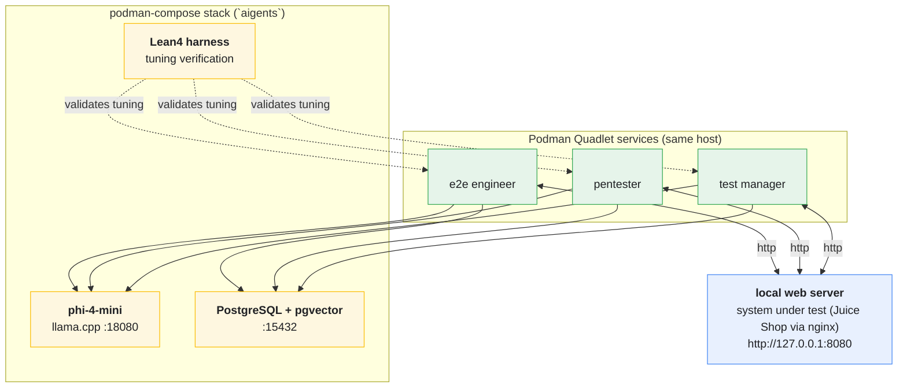

# open-testing-agents-paiselfhost

Self-hosted testing agents: three crewAI agents run **locally** on one server as
Podman **Quadlet** services, each connecting **directly** to a self-hosted
**phi-4-mini** model (llama.cpp) and a **PostgreSQL + pgvector** store. There is
**no MQTT broker** and no Raspberry Pi fleet anymore — everything lives on one
host and is declared in files, never hand-edited.

Tooling comes from the **nixpkgs** package set via the **Nix package manager**
(no NixOS required). Host services are provisioned with **OpenTofu**:
`model-setup/` renders a **podman-compose** stack for the database and AI model,
`sut-setup/` deploys a rootless SUT pod (nginx + Juice Shop + Grafana), and
`agent-setup/` renders the agent Quadlet units.

Agents chain results through shared files: e2e -> pentester -> test manager ->
final report, each role writing `previous_output.md` for the next one
(`worker/run_agent.py` stages a writable copy of its crew directory). All
reports land in the `documents` table in Postgres.

## Architecture

| Role            | Crew dir        | Work                              | Output            |
|-----------------|-----------------|-----------------------------------|-------------------|
| e2e engineer    | `build/e2e`     | playwright tests against the SUT  | `previous_output.md` |
| pentester       | `build/pentester` | nmap/nikto/sqlmap security scans | `previous_output.md` |
| test manager    | `build/manager` | review + final report             | `report.md`       |

Every cycle the worker asks the **Lean4 harness** to review the current tuning
parameters (`skills/lean/Main.lean` — queue_size, dedupe_cap, crew_timeout,
steps, step_cost). Only a verdict of `accepted` lets the crew run.

## Formal Verification with Lean4

- **Harnessing:** agent action boundaries, tool pre-conditions and state
  transitions are formal types in `skills/lean/AgentHarness.lean`.
- **Tuning:** proposed parameters are only applied when
  `AgentHarness.review` accepts them, giving a mathematically guaranteed
  safety loop. (The Agda source in `skills/agda` is kept for traceability.)

## Hardware & Model Specs

* **System RAM:** 16 GB (CPU-only inference; the box has an AMD iGPU without
  ROCm, so `model_gpu_layers = 0`)
* **Model:** `unsloth/Phi-4-mini-instruct-GGUF` — `Phi-4-mini-instruct-Q4_K_M.gguf`
  (~2.5 GB), served on `127.0.0.1:18080` as `phi-4-mini`
* **Embeddings:** phi-4-mini hidden size **3072** -> `vector(3072)` in pgvector
