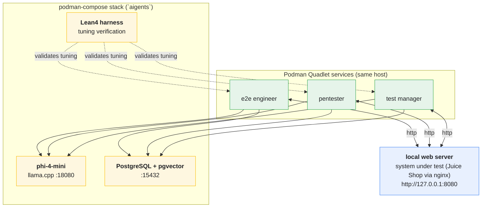

# open-testing-agents:selfhost

Self-hosted testing agents: three crewAI agents run **locally** on one server as
Podman **Quadlet** services, each connecting **directly** to a self-hosted
**phi-4-mini** model (llama.cpp) and a **PostgreSQL + pgvector** store. There is
**no MQTT broker** and no Raspberry Pi fleet anymore — everything lives on one
host and is declared in files, never hand-edited.

Tooling comes from the **nixpkgs** package set via the **Nix package manager**
(no NixOS required). Host services are provisioned with **OpenTofu**:
`model-setup/` renders a **podman-compose** stack for the database and the two
phi-4-mini instances, `sut-setup/` deploys a rootless SUT pod (nginx + Juice
Shop + Grafana), `agent-setup/` renders the agent Quadlet units, and
`odysseus-setup/` deploys the **Odysseus** web workspace (browser chat UI) as
Quadlet services. `start-services.sh` starts/stops all of them in dependency
order.



Agents chain results through shared files: e2e -> pentester -> test manager ->
final report, each role writing `previous_output.md` for the next one
(`worker/run_agent.py` stages a writable copy of its crew directory). All
reports land in the `documents` table in Postgres.

## Tofu/Terraform Usage on the agents services
Every module (`model-setup/`, `sut-setup/`, `agent-setup/`, `odysseus-setup/`)
accepts a `service_state` variable (`running` | `stopped`). The POSIX script
`start-services.sh` wraps them in dependency order:

```sh
./start-services.sh               # start everything: model -> sut -> agents -> odysseus
./start-services.sh stop          # stop everything in reverse order
./start-services.sh restart       # stop, then start
./start-services.sh status        # print each module's outputs
./start-services.sh start model-setup agent-setup   # target a subset
```

Or drive a module directly:

```sh
# Start
tofu -chdir=model-setup    apply -var service_state=running
tofu -chdir=sut-setup      apply -var service_state=running
tofu -chdir=agent-setup    apply -var service_state=running
tofu -chdir=odysseus-setup apply -var service_state=running
# Stop (reverse startup order)
tofu -chdir=odysseus-setup apply -var service_state=stopped
tofu -chdir=agent-setup    apply -var service_state=stopped
tofu -chdir=sut-setup      apply -var service_state=stopped
tofu -chdir=model-setup    apply -var service_state=stopped
```

Stopping keeps all state: podman images, GGUF weights, the Postgres data
directory and the Odysseus/agent volumes are untouched. `tofu destroy` in each
module removes the declared configuration completely — note the state is
currently git-ignored and was dropped, so on a fresh checkout `destroy` cannot
find the deployed services.

## Test manager CLI

Drive the **test manager** agent interactively from the terminal — streamed
answers against the self-hosted model, slash commands, and transcripts saved
to Postgres — like working with an agent in a coding terminal:

```sh
just tm                                  # or: nix develop -c python3 worker/tm_cli.py
./worker/tm_cli.py --once "summarize the last test results"
```

```
tm@aigents > /status        model + postgres connectivity
tm@aigents > /save          persist the transcript to postgres (collection tm_cli)
tm@aigents > /latest        print the most recent stored report
tm@aigents > /clear         reset the conversation (persona stays)
tm@aigents > /exit          quit (Ctrl+D works too)
```

The persona comes from the compiled `build/agents/test_manager_agent.json`
(`.dhall/test_manager_agent.dhall`), so the chat is `role`/`goal`/`backstory`
faithful. It honours `MODEL_URL`, `MODEL_NAME` and `POSTGRES_DSN` (the last
falls back to `database/secrets/credentials.env`). `/save` and `/latest` need
`psycopg` on the client (`pip install "psycopg[binary]"`); without it those two
commands report that Postgres is unavailable and everything else still works.

## Odysseus browser UI

`odysseus-setup/` deploys [Odysseus](https://github.com/odysseus-dev/odysseus) —
a self-hosted AI workspace — as four Podman Quadlet services. It is the browser
counterpart to the `tm` CLI and gives you a chat UI against the same
phi-4-mini model.

```sh
tofu -chdir=odysseus-setup output -raw admin_credentials   # login (also on disk)
cat /var/spool/aigents/odysseus/secrets/credentials.env
# UI: http://localhost:7000   (user: admin)
```

The module seeds the workspace declaratively on every apply: it registers the
two model endpoints (`http://127.0.0.1:18081/v1` for interactive chats,
`http://127.0.0.1:18080/v1` for crews) and installs/activates a **Test Manager**
character preset built from the compiled
`build/agents/test_manager_agent.json`. Pick that character (or the endpoint) in
the model picker and the chat runs as the test manager against phi-4-mini.

## Architecture

| Role            | Crew dir        | Work                              | Output            |
|-----------------|-----------------|-----------------------------------|-------------------|
| e2e engineer    | `build/e2e`     | playwright tests against the SUT  | `previous_output.md` |
| pentester       | `build/pentester` | nmap/nikto/sqlmap security scans | `previous_output.md` |
| test manager    | `build/manager` | review + final report             | `report.md`       |

Every cycle the worker asks the **Lean4 harness** to review the current tuning
parameters (`skills/lean/Main.lean` — queue_size, dedupe_cap, crew_timeout,
steps, step_cost) against that role's own `WellTuned` envelope. Only a verdict
of `accepted` lets the crew run.

## Formal Verification with Lean4

- **Harnessing:** agent action boundaries, tool pre-conditions and state
  transitions are formal types in `skills/lean/AgentHarness.lean`.
- **Tuning:** the safety envelope is role-aware — the e2e crew gets more,
  quicker steps, the pentester fewer, longer scan steps, the manager a
  moderate review budget. Proposed parameters are only applied when
  `AgentHarness.review` accepts them for that role, giving a mathematically
  guaranteed safety loop. (The Agda source in `skills/agda` is kept for
  traceability.)

## Hardware & Model Specs

* **GPU:** NVIDIA RTX 3060 (12 GB). llama.cpp runs the CUDA image
  (`ghcr.io/ggml-org/llama.cpp:server-cuda`) with `model_gpu_layers = 99`, so
  every phi-4-mini layer is offloaded to VRAM. The GPU is passed to the
  containers as a CDI device (`nvidia.com/gpu=all`) from the
  **nvidia-container-toolkit**; set `model_gpu_layers = 0` to fall back to CPU.
* **System RAM:** 16 GB.
* **Model:** `unsloth/Phi-4-mini-instruct-GGUF` — `Phi-4-mini-instruct-Q4_K_M.gguf`
  (~2.5 GB), served as `phi-4-mini` by **two** llama.cpp instances that share
  the mmapped weights: `127.0.0.1:18080` (agent crews, 2 parallel slots) and
  `127.0.0.1:18081` (interactive CLI/Odysseus, 1 slot).
* **Embeddings:** phi-4-mini hidden size **3072** -> `vector(3072)` in pgvector
