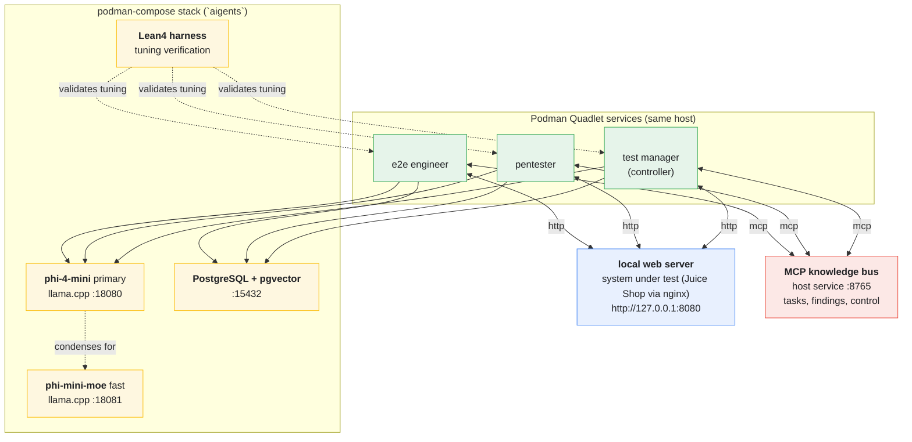

# open-testing-agents:selfhost

A self-hosted, fully declarative **testing lab** you can run on a single
machine: three AI agents — an **e2e engineer**, a **pentester** and a **test
manager** — test a real web application (**OWASP Juice Shop**), chain their
findings into one report, and stream the result to a browser chat UI. No cloud,
no MQTT broker, no hand-edited state.

It is a small but complete example of an *agentic stack* built from tools you
control end to end:

- **Agents** — three [CrewAI](https://www.crewai.com/) crews, each a Podman
  **Quadlet** service, loading role skills (`playwright-testing`,
  `test-manager-report`) and writing Playwright tests against the SUT. All three
  carry the same MCP bus tool, so they exchange findings **peer-to-peer**; the
  test manager is the **controller**: it assigns each test case to the e2e
  tester and/or the pentester, **monitors** their state and dispatched tasks,
  dispatches follow-ups, and **mails the final report** through Odysseus.
- **Model** — two self-hosted llama.cpp endpoints: **phi-4-mini** on the GPU
  (`:18080`) is the agents' brain (128K context + native tool calling), shared
  by every crew, the CLI and the chat; **phi-mini-moe** (`:18081`) is a fast
  helper that condenses the shared findings before they enter the primary's
  context.
- **Memory** — **PostgreSQL + pgvector** for reports and embeddings.
- **Knowledge bus** — a small **MCP** server (`mcp-setup/`) over which the agents
  exchange findings and the manager dispatches test cases, start/stop commands
  and the report mail (notes + documents land in Odysseus).
- **SUT** — **OWASP Juice Shop** behind nginx as a rootless pod
  (`http://127.0.0.1:8080`); it is the *one* target every agent is scoped to.
- **UI** — **Odysseus**, a self-hosted AI workspace, to chat with the test
  manager and read the generated test code and the live testing process.
- **Guardrails** — a **Lean4** harness formalises the agents' action boundaries
  *and* their single SUT; a crew only runs when both its tuning and its target
  are accepted.

Everything is provisioned with **OpenTofu** from the **nixpkgs** toolchain (no
NixOS required): `model-setup/` (podman-compose: database + both models),
`sut-setup/` (rootless SUT pod), `mcp-setup/` (the host MCP bus),
`agent-setup/` (agent Quadlets) and `odysseus-setup/` (the web workspace).
The root `deploy/` module composes all five services into one declarative
configuration. `just deploy` / `just down` / `just status` operate the whole
stack — no imperative shell scripts in production.



Agents exchange knowledge over the **MCP bus** (`mcp-setup/`): the test manager
dispatches test cases (controller) and monitors the team, every role shares
findings, and these feed the next role's run (`worker/run_agent.py` pulls the
assigned case + prior findings from the bus, condenses them with the fast model
and stages a writable copy of its crew directory). All three crews carry the
same `custom:aigents_bus` tool, so the agents also read each other's findings
and the manager's direction directly (see *How the agents talk to each other*).
Findings also land in the `documents` table in Postgres, the live testing
process is published to Odysseus as markdown, and the final report is mailed
through the Odysseus mail function.

The Dhall source in `.dhall/` compiles to the crews the workers run. After
editing it, recompile before (re)starting so the deployed agents pick up new
personas, tools and tasks:

```sh
nix develop -c just              # compile .dhall -> build/<role>/ (+ build/agents/)
nix develop -c just deploy       # deploy the whole stack (root deploy/ module)
```

## Declarative Root Module (`deploy/`)

The `deploy/` directory is the single declarative controller for the entire
stack. It composes all five services as child modules with dependency waves
falling out of OpenTofu's DAG:

```sh
# Deploy everything (model + sut + mcp + agents + odysseus)
tofu -chdir=deploy init
tofu -chdir=deploy apply -var run_interval=60 -var report_mail_to=test-manager@aigents.local

# With local Odysseus image (your fork with aigents-bus + Lean 4 MCP servers)
tofu -chdir=deploy apply -var build_app_image=true -var run_interval=60 -var report_mail_to=test-manager@aigents.local

# Stop everything
tofu -chdir=deploy apply -var service_state=stopped

# Status
tofu -chdir=deploy output
```

### Justfile Commands (Recommended)

```sh
just deploy           # full deploy (root module, service_state=running)
just down             # stop everything (service_state=stopped)
just status           # show outputs / service state
just pace 60          # set run_interval=60 and redeploy agents
just redeploy         # re-apply root module after code changes
```

Variables you can pass via `-var` or set in `deploy/terraform.tfvars`:
| Variable | Default | Description |
|----------|---------|-------------|
| `service_state` | `running` | `running` \| `stopped` |
| `run_interval` | `900` | seconds between agent runs |
| `report_mail_to` | `""` | mail recipient for test reports |
| `build_app_image` | `false` | build Odysseus from local `../odysseus` source |
| `enable_on_boot` | `false` | enable systemd units for auto-start |

### Per-Module Direct Control (Advanced)

Each module still accepts `service_state` and can be driven independently:

```sh
# Start in dependency order
tofu -chdir=model-setup    apply -var service_state=running
tofu -chdir=sut-setup      apply -var service_state=running
tofu -chdir=mcp-setup      apply -var service_state=running
tofu -chdir=agent-setup    apply -var service_state=running
tofu -chdir=odysseus-setup apply -var service_state=running

# Stop (reverse startup order)
tofu -chdir=odysseus-setup apply -var service_state=stopped
tofu -chdir=agent-setup    apply -var service_state=stopped
tofu -chdir=mcp-setup      apply -var service_state=stopped
tofu -chdir=sut-setup      apply -var service_state=stopped
tofu -chdir=model-setup    apply -var service_state=stopped
```

Stopping keeps all state: podman images, GGUF weights, the Postgres data
directory and the Odysseus/agent volumes are untouched. `tofu destroy` in each
module removes the declared configuration completely — note the state is
currently git-ignored and was dropped, so on a fresh checkout `destroy` cannot
find the deployed services.

## Test manager CLI (controller console)

Drive the **test manager / controller** agent interactively from the terminal —
streamed answers against the self-hosted phi-4-mini model, slash commands that
dispatch test cases to the e2e tester and pentester over the **MCP bus**, and
transcripts saved to Postgres:

```sh
just tm                                  # or: nix develop -c python3 worker/tm_cli.py
./worker/tm_cli.py --once "/case both test the login for sqli and xss"
./worker/tm_cli.py --once "how far along is the security test?"
```

```
tm@aigents > /case <role> <test case>   assign a test case (role: e2e|pentester|both|all) and start the agents
tm@aigents > /agents                    agent service state (systemd user units)
tm@aigents > /start [role]  /stop       start/stop the agent service(s)
tm@aigents > /tasks [role]              list the assigned test-case tasks
tm@aigents > /findings [role]           read the findings the agents shared on the bus
tm@aigents > /process    /publish       show / publish the live testing-process markdown
tm@aigents > /notes [label]             request the notes on the Odysseus web UI (latest results)
tm@aigents > /note <title> <text>       publish a note to the Odysseus web UI
tm@aigents > /mail [to]                 mail the latest report via the Odysseus mail function
tm@aigents > /status                    model + postgres + MCP bus connectivity
tm@aigents > /save   /latest  /clear    transcript persistence / recent report / reset
tm@aigents > /exit                      quit (Ctrl+D works too)
```

The persona comes from the compiled `build/agents/test_manager_agent.json`
(`.dhall/test_manager_agent.dhall`), so the chat is `role`/`goal`/`backstory`
faithful. Live bus state (tasks, agent status) is injected into the model
context each turn. It honours `MODEL_URL`, `MODEL_NAME`, `MCP_URL` and
`POSTGRES_DSN` (the last falls back to `database/secrets/credentials.env`).
`/save` and `/latest` need `psycopg` on the client
(`pip install "psycopg[binary]"`); without it those two commands report that
Postgres is unavailable and everything else still works.

## Odysseus browser UI

`odysseus-setup/` deploys [Odysseus](https://github.com/odysseus-dev/odysseus) —
a self-hosted AI workspace — as four Podman Quadlet services. It is the browser
counterpart to the `tm` CLI and gives you a chat UI against the same
phi-4-mini model (plus the fast phi-mini-moe endpoint).

### Your Odysseus Fork (External Repo)

The Odysseus source is cloned separately as a sibling of this repo:

```
/var/spool/aigents/
├── odysseus/                              # Your fork (external)
│   ├── mcp_servers/aigents_bus_server.py  # MCP server wrapping the aigents bus
│   ├── mcp_servers/lean_server.py         # Lean 4 formal verification harness
│   ├── src/builtin_mcp.py                 # Auto-registers both servers
│   └── Dockerfile                         # Installs Lean 4 via elan
└── testing-the-agentic-stack-open-testing-agent-/  # This repo
    ├── deploy/
    └── odysseus-setup/
```

Your fork adds two built-in MCP servers that auto-register on Odysseus startup:

| Server | Tools | Purpose |
|--------|-------|---------|
| **aigents-bus** | 14 tools | Wraps `http://127.0.0.1:8765/mcp` so the Test Manager in Odysseus chat can dispatch test cases, read findings, start/stop agents, publish notes/documents, and mail reports |
| **lean4** | 5 tools | Lean 4 / Lake formal verification (`lean_run`, `lake_build`, `lake_test`, `lake_init`, `lean_check`) |

Build the local image instead of pulling upstream:

```sh
tofu -chdir=deploy apply -var build_app_image=true ...
```

This runs `podman build` from `/var/spool/aigents/odysseus` and tags it
`localhost/odysseus:aigents`. The `deploy/` module passes `build_app_image`
through to `odysseus-setup/`.

### Logging into the front end

Open **<http://127.0.0.1:7000>** in a browser, then log in with the admin
account (default user `admin`) and the generated password:

```sh
tofu -chdir=odysseus-setup output -raw admin_credentials   # user + password
# or read it straight from disk (mode 0600):
grep ODYSSEUS_ADMIN_PASSWORD /var/spool/aigents/odysseus/secrets/credentials.env
```

- The module creates the admin account on first boot and writes the credentials
  to `/var/spool/aigents/odysseus/secrets/credentials.env`
  (`ODYSSEUS_ADMIN_USER`, `ODYSSEUS_ADMIN_PASSWORD`, `ODYSSEUS_URL`).
- Pin your own password instead of the generated one by setting it before
  apply: `tofu -chdir=odysseus-setup apply -var admin_password='...'`.
- `auth_enabled=true` (default) requires the login. `localhost_bypass=true`
  skips it for requests that look local — keep it `false` when publishing the UI
  beyond localhost.
- The UI is published on `bind_address:app_port` (default `127.0.0.1:7000`).

The module seeds the workspace declaratively on every apply: it registers the
model endpoints (`http://127.0.0.1:18080/v1` phi-4-mini primary +
`http://127.0.0.1:18081/v1` phi-mini-moe fast, when enabled) and
installs/activates a **Test Manager** character preset built from the compiled
`build/agents/test_manager_agent.json`. Pick that character (or the endpoint) in
the model picker and the chat runs as the test manager against phi-4-mini.

**Test results as notes.** After every run each role pushes its report into the
Odysseus **Notes** panel (Keep-style cards, label `test-results`, one note per
role holding the latest results) — so the web UI always shows the latest e2e /
pentester / final results as notes. You can also request them yourself: in the
`tm` CLI `/notes` lists them and `/note <title> <text>` publishes one; in the
chat ask the test manager for the latest results and it lists the notes through
its `aigents_bus` tool (`action=notes`).

### Test reports as mail

The test manager delivers its final report as **mail through the Odysseus mail
function** (`POST /api/email/send`). Every manager run mails `report.md`, the
`tm` CLI `/mail [to]` command mails the latest report, and the manager agent can
send it itself (`aigents_bus` `action=mail`).

Delivery needs an SMTP-capable mailbox. Configure it interactively (Settings →
**Email** in the UI) or declaratively from `odysseus-setup`:

```sh
tofu -chdir=odysseus-setup apply \
  -var smtp_host=smtp.example.com -var smtp_user=reports@example.com \
  -var smtp_password=... -var report_mail_to=you@example.com \
  -var imap_host=imap.example.com -var imap_user=reports@example.com -var imap_password=...
```

`report_mail_to` is written to `credentials.env` as `REPORT_MAIL_TO` and is the
default recipient used by the bus, the agents and `/mail`. Set
`imap_host`/`imap_user`/`imap_password` as well to also **receive** the reports
in the Odysseus mail inbox (and keep a copy in Sent). Until a mailbox is
configured, the mail step returns a clear "no SMTP-capable email account
configured" message and the report is still published as a note/document —
nothing else breaks.

### Test Manager in Odysseus Chat

When using a tool-capable model (phi-4-mini has native tool calling), the Test
Manager character in Odysseus chat can directly invoke the aigents-bus tools:

```
User: "Assign a test case to the e2e agent: test the login flow for SQL injection"
Assistant: [calls mcp__aigents_bus__assign_test_case]
```

Available aigents-bus tools in chat:
- `mcp__aigents_bus__assign_test_case` — dispatch test case to e2e/pentester/both
- `mcp__aigents_bus__get_findings` — read findings from any role
- `mcp__aigents_bus__get_agent_status` — check systemd state of agent services
- `mcp__aigents_bus__start_agent` / `stop_agent` — control agent services
- `mcp__aigents_bus__publish_process` — publish live process doc to Odysseus
- `mcp__aigents_bus__publish_note` — publish results note to Notes panel
- `mcp__aigents_bus__mail_report` — mail final report via Odysseus mail function
- `mcp__aigents_bus__get_process`, `list_tasks`, `has_open_task`, etc.

## How the agents talk to each other

All three crews carry the same `custom:aigents_bus` tool, so the e2e engineer,
the pentester and the test manager exchange knowledge **peer-to-peer over the
MCP bus** (`worker/mcp_server.py`) — not only through the worker:

- **test manager** — the controller and the user's interface: it assigns test
  cases (`action=assign`), starts/stops the agents and reads their state
  (`action=get_status`), inspects the task queue (`action=tasks`), reads the
  team's findings (`action=findings`), dispatches a follow-up pass when coverage
  is thin, and closes the loop by publishing the process (`action=publish`), the
  results note (`action=note`) and the report mail (`action=mail`);
- **e2e engineer / pentester** — read the manager's direction and each other's
  findings from the bus (`action=findings`), then share their own results
  (`action=note`, `action=submit`).

The worker still injects the live task + findings into every crew's inputs and,
for the manager, also the live **agent status and task list**, so monitoring
works even when the model does not call the tool itself.

Task accounting is honest: a run that crashes (`crewai failed: …`) or whose
Playwright test errors or times out closes its assigned task as status
`failed`, not `done` (`submit_findings` `success=false`) — the manager's
`tasks`/`get_status` views and the final report then reflect actual results
instead of pretending a broken run passed.

## Architecture

| Role            | Crew dir        | Work                              | Output            |
|-----------------|-----------------|-----------------------------------|-------------------|
| e2e engineer    | `build/e2e`     | playwright tests against the SUT  | `previous_output.md` (+ `playwright_test.py` published to Odysseus) |
| pentester       | `build/pentester` | nmap/nikto/sqlmap security scans | `previous_output.md` |
| test manager    | `build/manager` | control + monitor the team, final report | `report.md` (process doc + results note + mail in Odysseus) |

All three crews carry `custom:aigents_bus`, so the roles also read each other's
findings and the manager's direction directly off the bus (see *How the agents
talk to each other*).

Agents also load crewAI **skills** from `skills/` (progressive disclosure via
`SKILL.md`): `test-manager-report` for the manager, `playwright-testing` for the
e2e engineer.

Every cycle the worker asks the **Lean4 harness** to review the current tuning
parameters (`skills/lean/Main.lean` — queue_size, dedupe_cap, crew_timeout,
steps, step_cost) against that role's own `WellTuned` envelope. Only a verdict
of `accepted` lets the crew run.

## Formal Verification with Lean4

- **Harnessing:** agent action boundaries, tool pre-conditions and state
  transitions are formal types in `skills/lean/AgentHarness.lean`.
- **Tuning:** the safety envelope is role-aware — the e2e crew gets more,
  quicker steps, the pentester fewer, longer scan steps, the manager a
  moderate review budget. Proposed parameters are only applied when
  `AgentHarness.review` accepts them for that role, giving a mathematically
  guaranteed safety loop. (The Agda source in `skills/agda` is kept for
  traceability.)
- **Odysseus Integration:** the Lean 4 MCP server (`lean_server.py`) exposes
  `lean_run`, `lake_build`, `lake_test`, `lake_init`, `lean_check` tools so
  agents can verify specifications and run formal proofs from within the chat.

## Hardware & Model Specs

* **GPU:** NVIDIA RTX 3060 (12 GB). llama.cpp runs the CUDA image
  (`ghcr.io/ggml-org/llama.cpp:server-cuda`) with `model_gpu_layers = 99`, so
  every primary phi-4-mini layer is offloaded to VRAM. The GPU is passed to the
  containers as a CDI device (`nvidia.com/gpu=all`) from the
  **nvidia-container-toolkit**; set `model_gpu_layers = 0` for a pure-CPU run.
* **System RAM:** 16 GB.
* **Primary model (agents' brain):** `unsloth/Phi-4-mini-instruct-GGUF` —
  `Phi-4-mini-instruct-Q4_K_M.gguf` (~2.5 GB), alias `phi-4-mini`, one llama.cpp
  instance on `127.0.0.1:18080` shared by the crews, the CLI and Odysseus
  (context **65536** total = **16384 per slot**, **4** parallel slots, 3.8B
  dense, 128K native context, tool calling).
* **Fast model (supports the primary):** `smarttasks/Phi-mini-MoE-instruct-GGUF`
  — `Phi-mini-MoE-instruct-Q4_K_M.gguf` (~5 GB), alias `phi-mini-moe`, on
  `127.0.0.1:18081` (context **8192** = **4096** x 2 slots, 7.6B total / 2.4B
  active experts). Runs on CPU by default so it never competes for VRAM; the
  worker uses it to condense shared findings before they enter the primary's
  context.
* **Embeddings:** phi-4-mini hidden size **3072** -> `vector(3072)` in pgvector

## Reaching the stack from other devices (LAN)

Everything binds `127.0.0.1` by default. To connect from other devices in your
network, bind the services to `0.0.0.0` and open the firewall:

```hcl
# model-setup/ (owns the iptables rules for the whole stack)
bind_address   = "0.0.0.0"
model_api_key  = "change-me"        # required once you are not localhost-only
expose_public  = true
expose_ports   = [18080, 18081, 15432, 8080, 3001, 7000, 8888, 8100, 8091, 8765]
```

Also set `bind_address = "0.0.0.0"` in `sut-setup` and `odysseus-setup`, and
`mcp_host = "0.0.0.0"` in `mcp-setup`. Only list a port in `expose_ports` when
its owning module actually binds `0.0.0.0`. `tofu -chdir=model-setup output -json lan_matrix`
prints the full table.

| Service | Port | Owner module | Bind via |
|---------|------|--------------|----------|
| phi-4-mini OpenAI API | `18080` | model-setup | `bind_address` |
| phi-mini-moe OpenAI API | `18081` | model-setup | `bind_address` |
| PostgreSQL | `15432` | model-setup | `bind_address` |
| SUT nginx → Juice Shop | `8080` | sut-setup | `bind_address` |
| Juice Shop (direct) | `3000` | sut-setup | `bind_address` |
| Grafana | `3001` | sut-setup | `bind_address` |
| Odysseus UI | `7000` | odysseus-setup | `bind_address` |
| SearXNG | `8888` | odysseus-setup | `bind_address` |
| ChromaDB | `8100` | odysseus-setup | `bind_address` |
| ntfy | `8091` | odysseus-setup | `bind_address` |
| MCP bus (`/mcp`) | `8765` | mcp-setup | `mcp_host` |

> Expose the minimum: usually just `18080` (model) and `8080` (SUT) on a
> trusted network. Postgres and the model API should not leave localhost
> without `model_api_key` / a DB password.