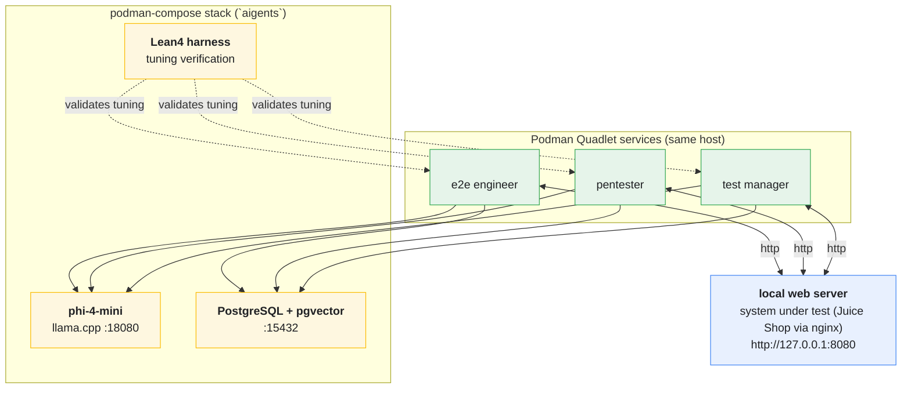

# open-testing-agents-paiselfhost

Self-hosted testing agents: three crewAI agents run **locally** on one server as
Podman **Quadlet** services, each connecting **directly** to a self-hosted
**phi-4-mini** model (llama.cpp) and a **PostgreSQL + pgvector** store. There is
**no MQTT broker** and no Raspberry Pi fleet anymore — everything lives on one
host and is declared in files, never hand-edited.

Tooling comes from the **nixpkgs** package set via the **Nix package manager**
(no NixOS required). Host services are provisioned with **OpenTofu**:
`model-setup/` renders a **podman-compose** stack for the database and AI model,
and `agent-setup/` renders the agent Quadlet units.



Agents chain results through shared files: e2e -> pentester -> test manager ->
final report, each role writing `previous_output.md` for the next one
(`worker/run_agent.py` stages a writable copy of its crew directory). All
reports land in the `documents` table in Postgres.

## Architecture

| Role            | Crew dir        | Work                              | Output            |
|-----------------|-----------------|-----------------------------------|-------------------|
| e2e engineer    | `build/e2e`     | playwright tests against the SUT  | `previous_output.md` |
| pentester       | `build/pentester` | nmap/nikto/sqlmap security scans | `previous_output.md` |
| test manager    | `build/manager` | review + final report             | `report.md`       |

Every cycle the worker asks the **Lean4 harness** to review the current tuning
parameters (`skills/lean/Main.lean` — queue_size, dedupe_cap, crew_timeout,
steps, step_cost). Only a verdict of `accepted` lets the crew run.

## Formal Verification with Lean4

- **Harnessing:** agent action boundaries, tool pre-conditions and state
  transitions are formal types in `skills/lean/AgentHarness.lean`.
- **Tuning:** proposed parameters are only applied when
  `AgentHarness.review` accepts them, giving a mathematically guaranteed
  safety loop. (The Agda source in `skills/agda` is kept for traceability.)

## Hardware & Model Specs

* **System RAM:** 16 GB (CPU-only inference; the box has an AMD iGPU without
  ROCm, so `model_gpu_layers = 0`)
* **Model:** `unsloth/Phi-4-mini-instruct-GGUF` — `Phi-4-mini-instruct-Q4_K_M.gguf`
  (~2.5 GB), served on `127.0.0.1:18080` as `phi-4-mini`
* **Embeddings:** phi-4-mini hidden size **3072** -> `vector(3072)` in pgvector

## Repo layout

- `.dhall/` — crew + agent definitions (Dhall, the single source of truth)
- `justfile` — compiles Dhall -> `build/<role>/crew.json` (run in `nix develop`)
- `worker/run_agent.py` — the local runner each agent container executes
- `model-setup/` — OpenTofu: PostgreSQL + pgvector + phi-4-mini as a
  **podman-compose** stack (`/var/spool/aigents/compose/compose.yaml`, project
  `aigents`)
- `agent-setup/` — OpenTofu: builds the agent image (`localhost/aigents-agent`)
  and writes the Quadlet units
- `sut-setup/` — OpenTofu: SUT pod (nginx + Juice Shop + Grafana)
- `skills/lean/` — Lean4 harness (`AgentHarness.lean`) + tuning CLI
  (`Main.lean`)
- `flake.nix` — the `nix develop` shell (lean4, dhall, tofu, just)
- `resources/`, `knowledge/` — the sources the agents use

## Quick start

```sh
nix develop -c just    # .dhall -> build/e2e, pentester, manager
```

Then provision the host in order:

```sh
cd sut-setup      && tofu init && tofu apply   # SUT pod first (target of tests)
cd model-setup    && tofu init && tofu apply   # compose stack: postgres + phi-4-mini
cd agent-setup    && tofu init && tofu apply   # agent image + quadlet services
```

`agent-setup` assumes the model (`18080`) and postgres (`15432`) from
`model-setup` are already listening on `127.0.0.1`.

<details><summary>One-shot sanity checks</summary>

```sh
curl http://127.0.0.1:18080/health            # llama-server up, weights mmap'ed
curl http://127.0.0.1:18080/v1/models         # reports "phi-4-mini"
psql "postgresql://aigents@127.0.0.1:15432/aigents" -c 'select collection, count(*) from documents group by collection;'
systemctl --user status agent-e2e.service
podman-compose -f /var/spool/aigents/compose/compose.yaml -p aigents ps
```

</details>

## Tuning

Default `Tuning {queue_size=32, dedupe_cap=256, crew_timeout=3600, steps=4,
step_cost=900}`. Per role overrides go through systemd user environment:

```sh
systemctl --user set-environment QUEUE_SIZE=64
systemctl --user restart agent-e2e.service
```

## Requirements

- One x86_64 Linux host with **16 GB RAM**, **Nix**, **Podman** and
  **OpenTofu** (all installed/declared by the OpenTofu modules)
- A local web server to test; the SUT setup deploys **Juice Shop** for us
- Internet during first `apply` (model weights ~2.5 GB, crewai image build)

## Further Notes

- Sources used live in `resources/`.

## Disclaimer

- Written mostly without generative AI; only open, self-hosted models are used.

## Contributions

- Welcomed, but restrictive on generative AI. A human must explain the change.